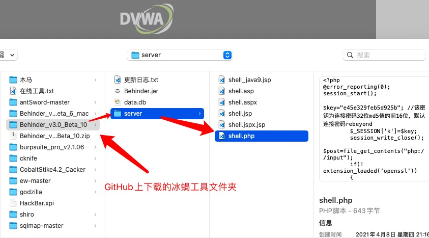
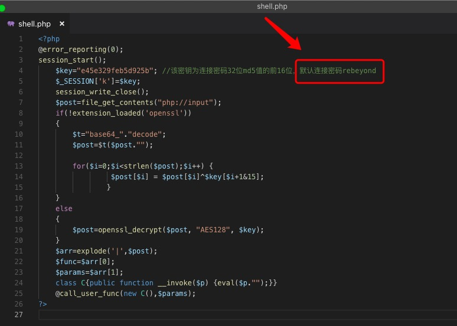
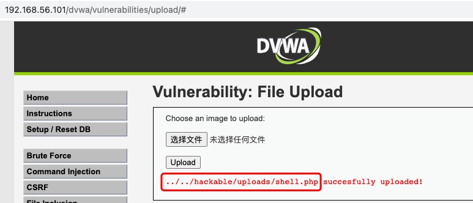
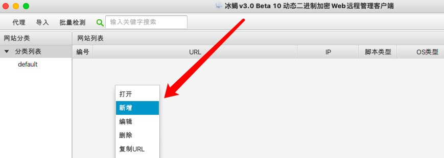
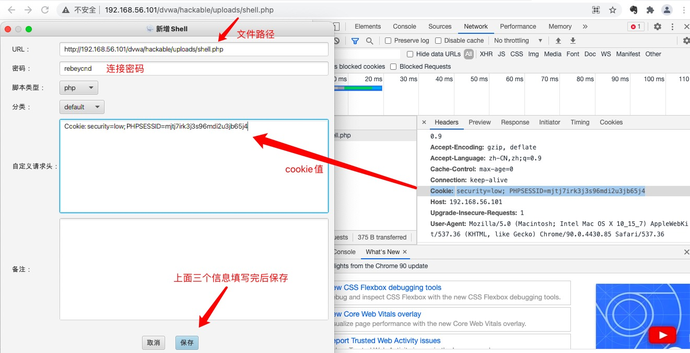
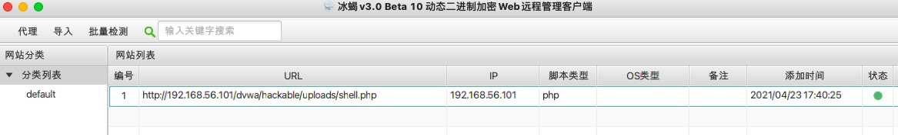
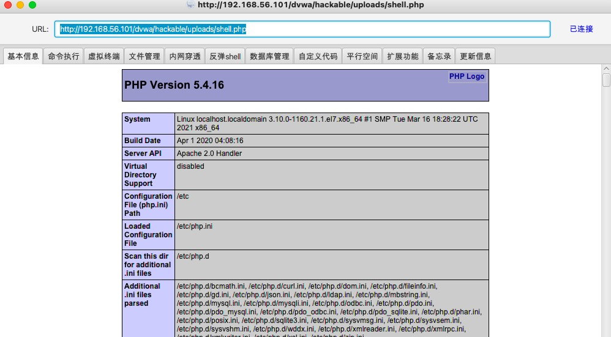

# 三、冰蝎   

冰蝎GitHub获取地址：  
[https://github.com/rebeyond/Behinder](https://github.com/rebeyond/Behinder)

## 0x00_目标  

1. 能掌握使用冰蝎基本使用即可  

## 0x01_冰蝎的使用方法  

##### a. 冰蝎连接木马  

文件上传详细步骤参考“一、菜刀”，冰蝎工具下载细节，请看考“二、蚁剑”。本文从上传文件进行分享：  
上传文件选择冰蝎工具 server 文件夹下的木马源码：  

   

打开 shell.php 文件，可以看到该木马的密码为 rebeyond  

   

上传后可以获取到木马存储路径  

   

启动冰蝎，并右键添加任务  

   

将木马存放路径，脚本中给出的连接密码，以及cookie填入连接信息，然后保存  

   

保存后双击任务连接木马  

   
   

-------------

### 推广：  

欢迎加入本人的QQ技术讨论群（CV技术讨论群）：736342355  
**CV，尽力做最专业的Ctrl+C、Ctrl+V的姿势搬运工。**